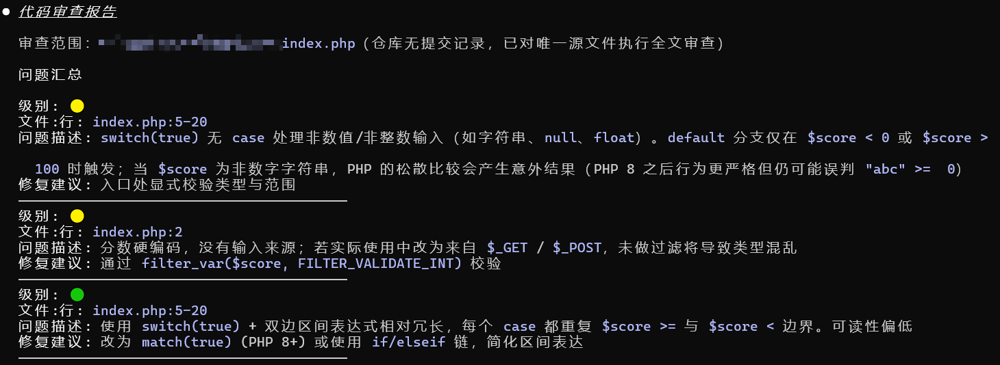
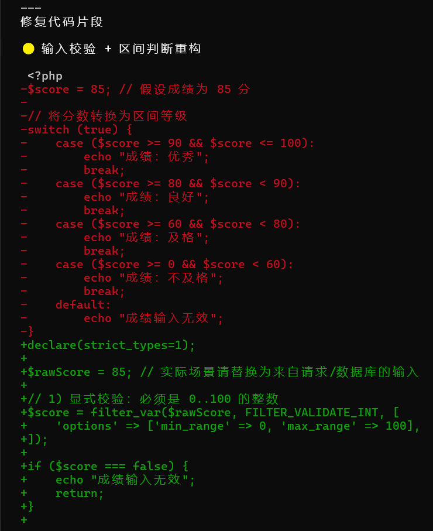
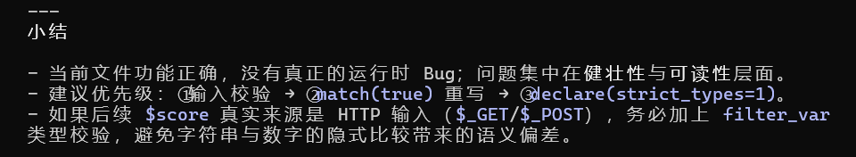

# 🧠 Code Review Plugin for Claude Code

> 一个为 **Claude Code** 打造的 AI 代码审查插件，用于在本地、团队协作或 CI 场景中，自动化地发现代码中的潜在问题，并输出结构化、可执行的审查报告。

> ⚠️ 本仓库内容由 [腾讯元宝](https://yuanbao.tencent.com/) 生成，作者已实测可用；但不对其安全性作任何担保，使用前请自行评估风险。

## 📦 插件内容

本插件采用 Claude Code 官方推荐的 Plugin 结构：

```text
code-review-plugin/
├── .claude-plugin/
│   └── plugin.json           # 插件元信息
├── skills/
│   └── code-review/
│       └── SKILL.md          # 代码审查 Skill
└── README.md                 # 本文档
```

## 🚀 安装方式

### 方式一：从 GitHub 安装（推荐）

在 Claude Code 会话中执行：

```bash
> /plugin marketplace add 16urls/code-review-plugin
> /plugin install code-review-plugin@code-review-plugin
```

> 也可以使用完整 URL：`/plugin marketplace add https://github.com/16urls/code-review-plugin`

### 方式二：本地开发测试

```bash
git clone https://github.com/16urls/code-review-plugin.git
```

在 Claude Code 会话中把本地目录注册为 marketplace 后安装：

```bash
> /plugin marketplace add /absolute/path/to/code-review-plugin
> /plugin install code-review-plugin@code-review-plugin
```

> 安装命令格式为 `<插件名>@<marketplace 名>`。由于本插件与 marketplace 同名，所以两侧都是 `code-review-plugin`。

## 🛠 使用方法

### 方式一：斜杠命令（推荐）

在 Claude Code 会话中直接输入：

```bash
> /code-review
```

> 若与其他插件命令重名，可使用插件命名空间显式调用：`/code-review-plugin:code-review`

### 方式二：自然语言自动触发

Skill 会根据上下文自动加载。在 Claude Code 会话中直接说：

- "帮我 review 一下刚才的 commit"
- "检查这段代码有没有 security 问题"
- "帮我做一下代码审查"

Claude 会自动加载 `code-review` skill，对当前代码上下文进行审查，并输出结构化报告。如需强制触发，也可以在提示中明确说 "用 code-review skill 审查 …"。

## 🖼 使用演示

调用 `/code-review` 后的实际效果：



Skill 自动加载并分析代码：



输出结构化的审查报告：



## 📊 审查维度

插件会从以下三个维度对代码进行分析：

- 🔴 **严重问题**：Bug、安全漏洞（SQL 注入 / XSS）、空指针、数据泄露风险
- 🟡 **风险点**：并发问题、边界条件、性能瓶颈
- 🟢 **改进建议**：代码可读性、命名规范、架构合理性

## 📝 输出格式

输出为 Markdown 表格，包含：

- 级别（🔴 🟡 🟢）
- 文件路径 + 行号
- 问题描述
- 修复建议（含代码示例）

示例：

```markdown
## Code Review Report

| 级别 | 文件:行 | 问题描述 | 修复建议 |
|----|----|----|----|
| 🔴 | `auth.ts:45` | 空指针风险：未校验 token 是否为 null | 增加 `if (!token) throw new Error(...)` |
```

## 📌 注意事项

- 请确保你的项目已初始化 Git（`git init`），以便 skill 能读取 diff。
- 本插件不依赖外部服务，纯本地运行，保障代码隐私。
- 支持 TypeScript、JavaScript、Python、Go、Rust、PHP 等主流语言。

## 🤝 贡献与反馈

欢迎提交 Issue 或 Pull Request：

- 修复误报
- 增加新语言支持
- 优化输出格式

GitHub 仓库：https://github.com/16urls/code-review-plugin

## 📄 License

MIT License
